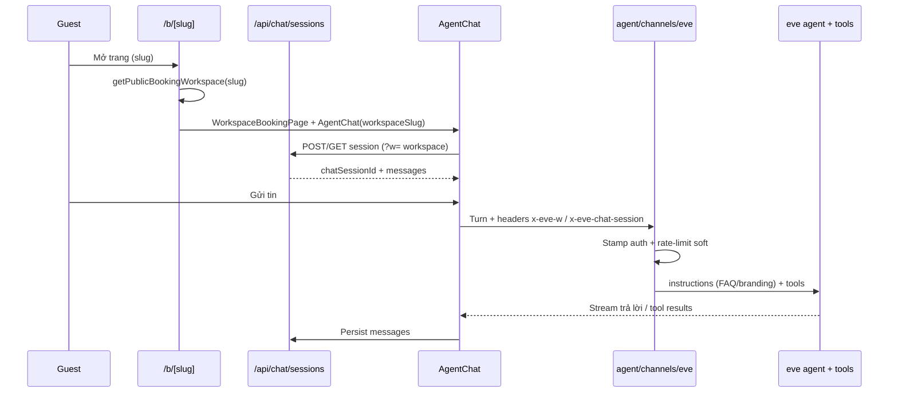

# Luồng hoạt động chat Eve (khách đặt / hủy / đổi lịch)

> Trạng thái: **đã triển khai**. Viết ngày 2026-08-04.
> Phạm vi: khách vãng lai trên `/b/[slug]` (và embed cùng bề mặt) — từ mở chat → đặt lịch → hủy/đổi.
> Không bao gồm: dashboard staff handoff chi tiết, kênh Zalo/Messenger (dùng cùng agent tools nhưng bootstrap khác).

Tài liệu liên quan:

- Hủy/đổi + thang sở hữu: [`guest-booking-change.md`](./guest-booking-change.md)
- Múi giờ khách: [`guest-timezone.md`](./guest-timezone.md)
- Reminder + magic link quay lại chat: [`outbound-reminders.md`](./outbound-reminders.md)
- Email tùy chọn khi đặt: [`specs/2026-08-04-optional-guest-email-design.md`](./specs/2026-08-04-optional-guest-email-design.md)

---

## 1. Chat Eve là gì?

Chat Eve là **lễ tân AI** gắn với một workspace (doanh nghiệp). Khách nói chuyện bằng ngôn ngữ tự nhiên; agent gọi tool thật (Cal.com + Supabase) — **không bịa slot**.

| Bề mặt | Ý nghĩa |
|--------|---------|
| `/b/[slug]` | Trang đặt lịch công khai của tenant thật |
| Embed (widget) | Cùng UI/session API; client phải gửi `?w=` / header workspace |
| `/chat` | **chỉ** Eve Pilot demo (marketing) — dùng `CALCOM_API_KEY` env, không phải calendar tenant |

Owner cấu hình branding, FAQ, event type AI, Cal key ở `/dashboard`. Khi `bookingLive` chưa sẵn sàng, `/b/[slug]` hiện trang “chưa sẵn sàng”, không mở chat đặt lịch.

---

## 2. Danh tính & tenant (luôn cần nhớ)

Mỗi lượt chat thuộc **một** `workspace_id`. Sai tenant = bug nghiêm trọng.

```
Browser
  ├─ cookie eve_visitor_id     (httpOnly, TTL dài — cùng máy/trình duyệt)
  ├─ chat session id           (Supabase chat_sessions, gắn workspace_id)
  └─ headers khi gọi agent
        x-eve-w              → workspace slug
        x-eve-chat-session   → chat_sessions.id
        x-eve-locale         → en | vi
        x-eve-tz             → IANA tz trình duyệt (nếu có)
```

**Channel** `agent/channels/eve.ts` đọc cookie/header → stamp vào auth attributes (`workspaceSlug`, `chatSessionId`, `visitorId`, `locale`, `guestTimeZone`).

**Tool** resolve tenant qua `resolveWorkspaceIdFromAgentContext()` (`lib/workspace.ts`):

1. `chat_sessions.workspace_id` từ `chatSessionId`
2. fallback slug `x-eve-w`
3. nếu có hint tenant nhưng resolve fail → **throw**, không fallback Pilot
4. không có hint (CLI/Pilot) → workspace mặc định / Pilot

Cal key: `getCalApiKeyForWorkspace` + `withCalApiKey` — env `CALCOM_API_KEY` chỉ cho Pilot.

---

## 3. Bootstrap UI → agent



Điểm chính:

1. **Page** (`app/b/[slug]/page.tsx`) — server: workspace, locale cookie, optional magic link `?mt=` (từ reminder) → `consumeManageLink` gắn session đã verify.
2. **AgentChat** (`app/_components/agent-chat.tsx`) — client: tạo/load session qua `/api/chat/sessions?w=…`, gửi tin kèm header tenant, lưu transcript.
3. **Channel** — auth (OIDC / localDev / none), stamp tenant, kiểm tra `reply_mode === "human"` (staff đang trả lời thì agent nhường), rate-limit.
4. **Agent** — `agent/instructions.ts` + skills (`agent/skills/booking_intake.md`, `booking_change.md`) + `agent/tools/*`.

---

## 4. Luồng đặt lịch (intake → book)

Skill: `agent/skills/booking_intake.md`.

### 4.1 Hội thoại (một câu hỏi mỗi lần)

1. Dịch vụ / mục đích  
2. Khung giờ ưa thích  
3. Mức gấp  
4. **Họ tên + SĐT** luôn; **email** hỏi thêm (giúp tự hủy/đổi sau) — chỉ **bắt buộc** nếu tool trả `BOOKING_EMAIL_REQUIRED` (toggle Settings: Require guest email)

### 4.2 Tool

| Bước | Tool | Việc |
|------|------|------|
| Xem slot | `check_availability` | Slot thật từ Cal (today/future, tôn trọng minimum notice) |
| (Tuỳ) lead | `log_lead` | Lưu lead khi có tên + (phone hoặc email), chưa book / bỏ giữa chừng |
| Đặt | `book_appointment` | Gate policy email → re-check slot → `createWorkspaceBooking` |

### 4.3 Bên trong `book_appointment` / `createWorkspaceBooking`

```
book_appointment
  → resolveWorkspaceIdFromAgentContext
  → getWorkspaceGuestPolicy (guestEmailRequired?)
  → getAiBookingEventType + Cal API key
  → resolveGuestBookingActor / timezone
  → re-check getAvailableSlots
  → createWorkspaceBooking
        → email trống? → placeholder guest-<uuid>@no-email.invalid (nếu policy cho phép)
        → createBooking (Cal.com) — luôn có attendee.email
        → insert bookings (+ manage_code_hash)
        → upsertLeadAsBooked
        → notification owner
  ← trả manageCode (một lần, cleartext) cho agent đọc cho khách
```

Agent **phải** đọc `manageCode` cho khách một lần sau khi book thành công. Không bịa mã.

**Email thật vs placeholder:** Cal.com có thể gửi confirm của nó tới email thật. Placeholder `.invalid` → mail Cal bounce im; reminder Eve **skip** (`no_email`). Chi tiết: spec optional-guest-email.

---

## 5. Luồng hủy / đổi lịch

Skill: `agent/skills/booking_change.md`.  
Chi tiết bằng chứng sở hữu: [`guest-booking-change.md`](./guest-booking-change.md).

### 5.1 Nguyên tắc

- **Không bắt đăng nhập.**  
- **Không** hủy chỉ vì khách tự khai email/SĐT (dễ giả).  
- Agent leo thang theo thứ tự skill — không nhảy thẳng OTP khi A đã claim được.

### 5.2 Thang xác minh (rút gọn)

| Bậc | Bằng chứng | Ma sát |
|-----|-----------|--------|
| **A1** | Booking cùng phiên chat (`session_id` / `chat_session_id`) | 0 |
| **A2** | Cùng `visitor_id`, phiên khác → xác nhận 4 số cuối SĐT | thấp |
| **A⁺** | Session có `user_id` + email profile (phụ) | 0 |
| **B** | Manage code 6 ký tự lúc book | thấp |
| **C** | OTP gửi email đã dùng lúc book (không dùng được với placeholder) | trung bình |
| **D** | `request_booking_change` — staff duyệt | — |

### 5.3 Tool

```
list_my_appointments
  → (nếu cần) verify_booking_code  [manage_code | email_otp | phone_last4]
  → cancel_appointment
  hoặc check_availability → reschedule_appointment
  hoặc request_booking_change / request_booking_otp
```

Policy workspace: `guest_cancel_enabled`, `guest_reschedule_enabled`, `guest_change_cutoff_minutes` (`getWorkspaceGuestPolicy`).

Magic link từ reminder (`?mt=`) verify sẵn → khách vào chat đã claim được booking, nói “hủy/đổi” là dùng được nhanh.

---

## 6. Sơ đồ tổng end-to-end

```mermaid
flowchart TD
  A[Khách mở /b/slug] --> B{bookingLive?}
  B -->|không| Z[Trang chưa sẵn sàng]
  B -->|có| C[AgentChat + chat_sessions]
  C --> D[Chat với agent]
  D --> E{Ý định?}
  E -->|Đặt lịch| F[booking_intake]
  F --> G[check_availability]
  G --> H[book_appointment]
  H --> I[Cal.com + bookings + manageCode]
  E -->|Hủy / đổi| J[booking_change]
  J --> K[list / verify / cancel|reschedule]
  K --> L{Chứng minh được?}
  L -->|có| M[Cal.com + mirror bookings]
  L -->|không| N[request_booking_change → staff]
  I --> O[Mail Cal tùy email thật]
  I --> P[Eve reminders nếu bật + email thật]
```

---

## 7. Bản đồ file (đọc khi debug)

| Lớp | File |
|-----|------|
| Trang công khai | `app/b/[slug]/page.tsx`, `app/_components/workspace-booking-page.tsx` |
| UI chat | `app/_components/agent-chat.tsx` |
| Session HTTP | `app/api/chat/sessions/**` |
| Channel tenant | `agent/channels/eve.ts` |
| Prompt động | `agent/instructions.ts`, `agent/skills/*.md` |
| Tools | `agent/tools/book_appointment.ts`, `check_availability.ts`, `cancel_appointment.ts`, `reschedule_appointment.ts`, `list_my_appointments.ts`, `verify_booking_code.ts`, … |
| Domain | `lib/workspace.ts`, `lib/booking-create.ts`, `lib/agent-booking-auth.ts`, `lib/calcom.ts`, `lib/guest-email-placeholder.ts` |

---

## 8. Checklist kiểm tra nhanh

1. `/b/<slug>` mở chat đúng branding workspace đó (không lẫn Pilot).  
2. Đặt lịch: agent chỉ offer slot từ `check_availability`; sau book có `manageCode` trong transcript.  
3. Dashboard bookings mirror đúng; Cal.com có booking.  
4. Cùng phiên: hủy không cần mã. Phiên khác / máy khác: manage code hoặc OTP (nếu có email thật).  
5. Workspace tắt “Require guest email”: book không email → placeholder; dashboard không hiện raw `*@no-email.invalid`; reminder không spam fail.  
6. Header/`?w=` thiếu trên embed → session/tool fail closed, không ghi nhầm tenant.

---

## 9. Việc cố ý nằm ngoài doc này

- Staff `reply_mode = human` / handoff dashboard  
- Cron sync Cal → Supabase (ảnh hưởng dữ liệu, không phải path chat gửi tin)  
- Zalo / Messenger channels  
- Chi tiết RLS, billing gate (`assertWorkspaceSubscriptionActive`) — chỉ cần biết: subscription inactive → tool/booking dừng với lỗi đã format  
